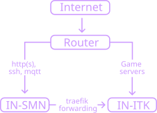

As listed in [Servers](./servers), we have two main servers: IN-SMN and IN-ITK.

IN-SMN is the primary server and runs the vast majority of our self-hosted infrastructure.

IN-ITK is managed by [ITK](https://itk.gg), and is primarily used to host game servers using Pterodactyl.

The router has port forwarding setup to both IN-SMN and IN-ITK for their respective ports.

Since most games use higher ports numbers, a range of these ports have been forwarded to IN-ITK, thereby not requiring configuration of the router
for most games.

Since port 22 (standard SSH port) goes to IN-SMN, port 2222 is the port used for SSH to IN-ITK.

<CalloutExt type="note">
  Since HTTP(S) traffic (port 80 and 443) goes to IN-SMN, hosting websites on
  IN-ITK requires IN-SMN to forward it to IN-ITK using
  [traefik](in-smn/traefik).
</CalloutExt>

## Netlify

Some services/websites need higher availability, such as [kth.it](kth.it) and the major committee websites.
These should be hosted on a high availability service, commonly [Netlify](https://www.netlify.com/).

Since kth.it is on Netlify and not hosted on IN-SMN, we have two DNS records. One for `kth.it` that goes to Netlify, and a wildcard `*.kth.it` that goes to our servers.
As such, when using SSH to the server, use `server.kth.it` as the IP instead of `kth.it`. The DNS records are configured on Netlify.
