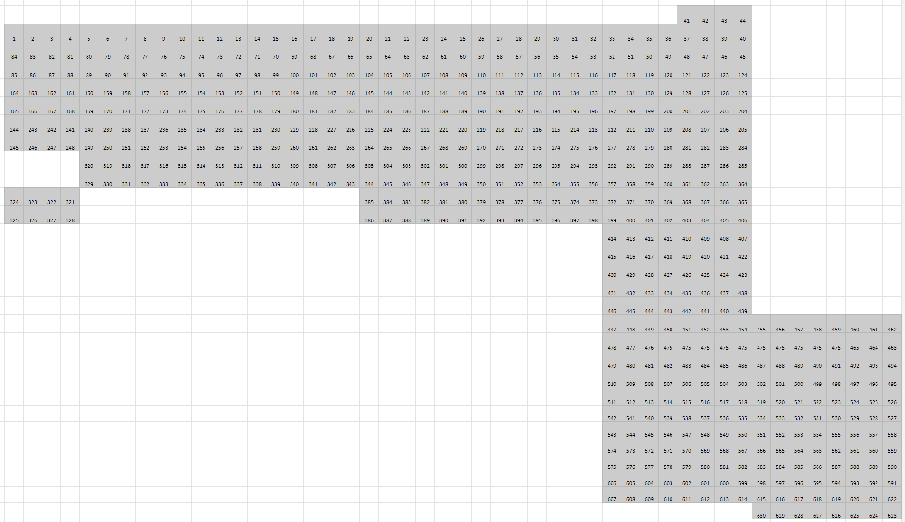

More about roof LED on [this page][1].

## Led order

Each pixel is represented as a fixture in the LMixer and has 3 channels.
Addressing is linear and can be followed like a snake back and forth in the
roof. See the picture below for exact fixture IDs.

## Power distribution

The LEDs in the roof run on 5V power.

Power to all LEDs is distributed using a set of speaker cables. The three PSUs
share a common negative rail with a separate cable going between them. The cable
between the LEDs is cut between the power distribution lines to separate the
positive power rail from the different PSUs.

The power from the PSU is made as follows.

