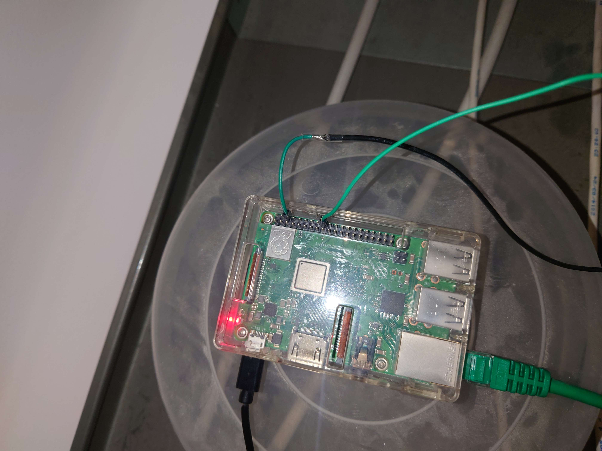
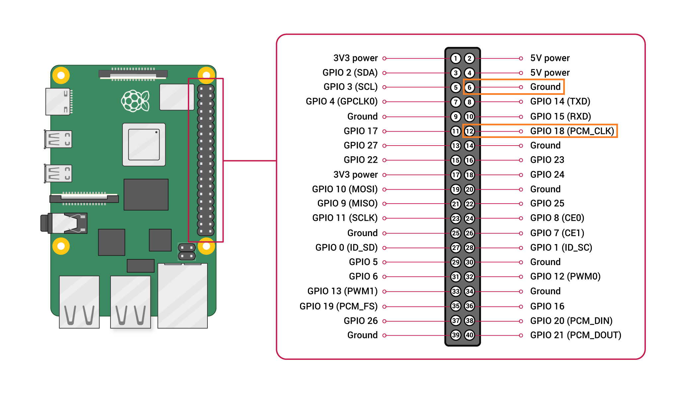
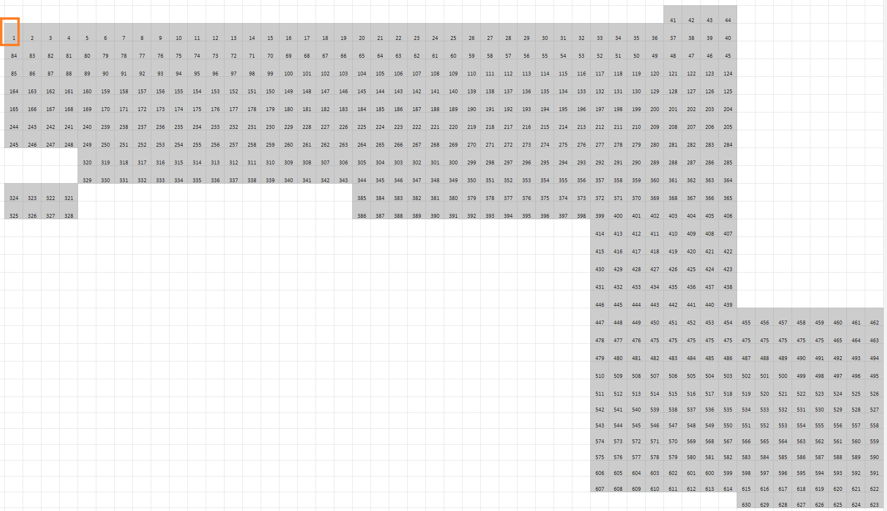

Kistan has a grid of pixels on the roof controlled by a single controller. The
pixels are connected using wires and divided into three different power supply
groups (see [power drawing](../../drawings/roof_led)).

## Connection to LMixer

All roof LEDs are controlled by a single controller. It is connected to the same
network as the servers and LMixer is streaming the layer data over the network
using UDP.

## Raspberry Pi

A Raspberry Pi with custom software is used to control the roof LEDs. It is
powered with a normal USB Power supply and is connected to the internet with a
LAN cable.

The black wire is connected to ground on pin number 4 (GND)

The green wire is connected to data on pin number 12 (GPIO18)

### Location of Pi

The Pi is located on top of the cable tray in the roof. As indicated on this
picture.

